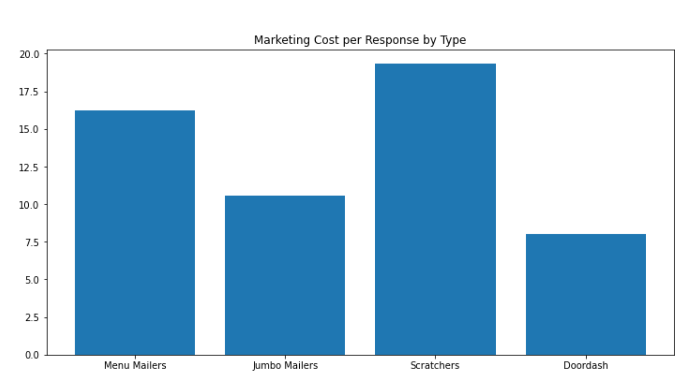
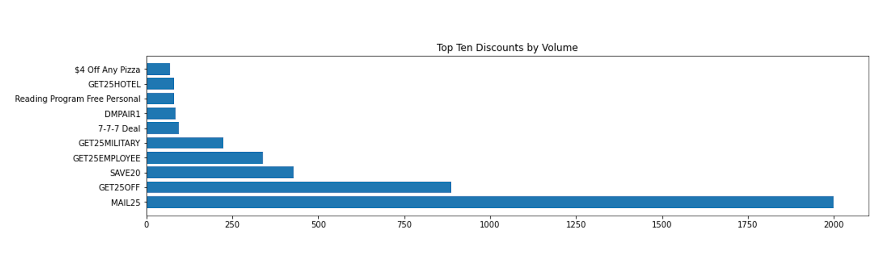

 <h1> A Pizza the Profit </h1> 

 <h2> Sales Regression Analysis for a local Pizza franchise 
 </h2> 

  

 Photo by <a href="https://unsplash.com/@iavnt?utm_source=unsplash&utm_medium=referral&utm_content=creditCopyText">Ivan Torres</a> on <a href="https://unsplash.com/s/photos/pizza?utm_source=unsplash&utm_medium=referral&utm_content=creditCopyText">Unsplash</a>

## Main Files:
* Images
* EDA & Data Cleaning.ipynb - Data Cleaning and Preparation, EDA notebook
* Final Modeling Notebook.ipynb - Notebook containing final modeling 
* Prelim Modeling.ipynb - Notebook containing preliminary modeling iterations 
* Presentation.pdf - Presentation slides

## Introduction

The goal of every business is to be profitable. In the current climate, it is more crucial than ever to be in tune with what works and what doesn't for your business, especially when it comes to highly competitive industries like the restaurant industry. I have been provided live data from a local pizza franchise with the goal of identifying by what means are they most likely to increase their customer base and sales, thus increasing profitability, and with any luck, their brand loyalty as well. 

### Due to the nature of the business problem and sensitivity of the data provided, supplied proprietary data has been omitted from the repository. 

#### Stakeholder & Business Problem: A local pizza franchise looking to bring in new customers and encourage existing customers to continue returning. It is my goal to identify if a specific discount code or dollar value is the most likely to increase sales and by what amount.

##### Targeted Metrics - R-Squared (Explained Variance) and RMSE
##### Null Hypothesis - The independent variables (in our case, the discount codes and values) together do not explain any variability in the dependent variable (net sales). 
##### Alternate Hypothesis - The independent variables together do explain variability in the dependent variable.

## Data Understanding: 

Data collected is from business backend sales software. I have a plethora of reports including a Sales Summary, Order History, Discounts Report, Operations Report and Marketing Report. 

 * Sales Report has 188 columns - a lot of which are irrelevant and have zeros (for example, Pass Through Fee Total, Donations, Due Amount Payable, Due Amount Receivable, House Account Receivable Tips, Gift Sales Payable Tips, Store Credit Sales Payable Tips, Lia Deposits Payable Tips, Lia Deposits Receivable Tips all have zeros and likely will not provide much insight for this analysis and could be dropped. Due to only having August 2020 to Feb 2022 sales information, this ends up at a 520 row dataframe. Not enough data for modeling per project requirements, but enough to potentially be useful for other statistical analysis in the EDA section. 
 

  * Discount codes could provide valuable insight as to what customers are using and what they're not, as well as what avenues they're coming in from. This will prove to be a challenge to model with the number of unique discount codes in the hundreds and being categorical features that will require encoding. To get these reports and codes into a modelable state, I've merged the Order History and Order Discounts reports together on order number, giving me over 5000 unique order numbers to model. From there, I will prepare the merged dataframe for modeling by One Hot Encoding the discount codes.
  
  
  * The marketing report provides insight as to which coupon codes and from which campaign are utilized. There are tabs for Valpak, Menu Mailers, Jumbo Postcards, and Scratcher mailers that mailed over various weeks and time periods. These reports also contain response to the mailer information, as well as revenue uplift, gross profit, and ROI information. During my analysis, I discovered that the Menu Mailers tab was incorrectly totaled, and communicated this with the stakeholder so as to ensure that any action he was already taking based on that report took this error into account. The total responses were miscalculated, which then threw off all of the profit and ROI information by about 26%. While these are useful reports in Excel for a stakeholder, they are difficult to manipulate. This was an extensive cleaning process and is described separately below. There is not enough data within these reports to model and utilize machine learning for identification of optimal marketing strategy. Will use descriptive and inferential statistics strategies in the EDA section at the bottom of this notebook to communicate findings with the stakeholder. Data cleaning and preparation steps for this analysis will be outlined in the Marketing Data Preparation section below.
  
  
  * I was also provided a PDF transaction report. Much of that shows the MailShark costs which are captured in the Excel sheet. The other costs reflected in the PDF are Facebook costs. When discussed with the Business Owner about quantifying the effectiveness of the marketing campaign on Facebook (ie - what metrics did they provide to evaluate performance?), I was advised that the majority of the costs seen on that report are for hiring advertising, not marketing for sales. Therefore, this PDF will not be utilized for this analysis at this time.
      * However, of interest during this discussion, it was noted that one ad was run for a 'Customer Appreciation Day' on Facebook that was largely successful. The cost was \$300 and their orders for the day tripled. Normal order volume ranges from 75-100 and spiked to 300 before 6 pm, phones had to be shut off. Cost of a pizza for that promotion was about \$7 that day. 
      

 * Additional reports provided include:
     * Sales by Class which provides the sales amounts in both dollar value and volume by the item class sold. Digging into sales by specific item would be an interesting topic for futher analysis.
     * Voids/Returns which provides a similar style report to the discount code report, but for returns and voids with their reasonings.
    

## EDA-Data Preparation

Each report is sent by year, so I have one for August 2020 through Jan 31 2021 and Feb 01, 2021 through Feb 01, 2022 for each report type. Each is imported and combined together on order number or date (depending on the report) to make one dataframe per report type. There are no "null" values, other than NaN cells that imported incorrectly with the marketing report, creating a difficult manipulation process. I converted the dates to DateTime objects, just in case a TimeSeries analysis is appropriate or date calculations are needed. Once all of my data is cleaned, I pickled my Dataframes so that I could call them up in a secondary (and eventually a third) noteboook.

### Marketing Expense Data Cleaning

For the purpose of the analysis, I will break each mailer type into a DF for costs and response versus total sent for each type. Data is from August 2020 through December 2021 for this Marketing information. I will make the dates DateTime objects for usability later - in case TimeSeries analysis proves to be valuable. Each type has a "Total" column in it's dataframe that will need to be dropped. 

   * During my analysis, it is discovered that the reports provided are not totaled correctly, so the values in the provided Excel report are not calculated correctly. The values in my DataFrames differed, and when I went to do a sanity check to confirm my values and concatenations came through correctly, I discovered summations were improperly performed within Excel, which resulted in the revenue and ROI figures to be off by approximately 26%. I did advise the stakeholder as soon as it was discovered.

   * Valpak does not provide a number of what was sent out to compare the responses to, whereas the other three categories do. Eliminating ValPak from analysis for the time being.

#### Jumbo Mailers
Jumbo Mailers ran Jan through Sept 2021 according to the household mailer column, though I only see costs associated with January. 
With a total sent of 5000 and total customer response of 622, cost per response on the Jumbo Mailers is \$10.59.

#### Scratch Off Mailers
Scratch Off mailers ran October through December of 2020.
With a total sent of 15000, cost per response for Scratch Off Mailers \$18.21

#### Menu Mailers
Menu Mailers ran August through October of 2020.
Cost per response for Menu Mailers \$16.24

#### DoorDash
##### Note that the "sent" column for DoorDash is purely synthetic in this marketing DataFrame. There is nothing to 'send' for DoorDash in terms of marketing, though I do have a cost for this to quantify. This 9999 number is a random value and would likely be a low number given the time period and number of users on DoorDash that are likely to be presented the pizza franchise as an option.. See [this article for DoorDash user statistics.](https://www.businessofapps.com/data/doordash-statistics/)
DoorDash marketing has currently running promotions, not factored in this analysis. There were two run periods. The first being Nov 9, 2021 through Dec 9, 2021, but lists no customers gained. The second run period of Oct 14, 2021 through 2022 net 110 customers. Cost per response overall for DoorDash marketing \$8.02

I wanted to visualize the top discounts by volume to compare to the modeling results. I also plotted the top reasons for return/cancellation for interpretation with the marketing expenses and NLP sentiment analysis, if time allows. MAIL25 far exceeds other discount codes, followed by GET25OFF and SAVE20. Employee and Military discounts round out the top 5 by volume.

Return reasons are a bit harder to interpret, given each employee is going to input their own variation of a reason. "Mistake" was the top reason for both return/cancellation in terms of volume and dollar value. However, an interesting thing seen on the dollar value visualization is the top reasons seem to center around "Deal", "Coupon", "Special", etc with some repetition in "Made twice", "duplicate order", and "entered twice". Additionally, on the returns by Volume, "Late" and "Late Missing Items" are the second and third highest reasons in terms of volume. Interestingly, reasons featuring the word "DoorDash" appear three times, and "deal" and "coupon" appear again. There will need to be significant feature engineering in this dataset before meaningful recommendations can be made due to the complexity and sheer volume of reasons listed. Misspelling, capitalization, and addition/modification of a word in the term all create a new "code". NLP strategies could possibly be implemented here to improve the variation in reason and code distribution.

I was surprised by the average sales by day of the week! Saturday and Sunday intuitively makes sense, but I was surprised that Monday overtook Friday. It will be interesting to recheck this after removal of outliers in the futher analysis steps.

There also appears to be a factor in terms of seasonality with the sales. There is a climb in the summer months, with a decrease in the winter. This may be worth future analysis with more data. 

In the modeling notebooks, I did end up doing additional data preparation steps post train-test split. I had applied StandardScaling to check performance with and without scaled data. Additionally, it was discovered that during preliminary modeling, some of the assumptions of Linear Regression (multicollinearity, homoscedasticity, and normal distribution of residuals) had been violated (thanks to help from Jeff Macaluso, and [his post on linear regression assumptions here](https://jeffmacaluso.github.io/post/LinearRegressionAssumptions/)). In the Final Modeling Notebook, a log transformation was applied to the data in attempt to correct the latter two of the assumption violations, but with no success. This is addressed futher in the modeling section below.
 
# Modeling

### Preliminary Modeling 

The initial model, as expected, performs poorly. I run a SelectKBest to identify the best features in terms of both correlation and information gain. Once those features are identified, I rerun my baseline model to check performance. From there, iterations are continued and described throughout the notebook. With average net sales per order being in \$25.00 and a median order of \$23.00, an RMSE of \$9.93 still leaves something to be desired here. Standard linear regression with Ridge Regularization is pegged with lambda strength of .01 and solver type `svd`, as seen in the visualizations below. Moving on to other Regressor model types to see if any further improvements in the metrics can be made.

In reading through the Scikit-learn documentation, I found several interesting and useful modeling methods and examples that may be worth exploration in my analysis. 

* Voting regressors are ensemble meta-estimators that fit several base regressor models on the whole dataset, and then average the individual predictions to form a final prediction. Reading this page in Scikit-learn goes over how to run these types of models as well as how to plot both the individual predictions as well as the Voting Regression predictions as well. Using this methodology, I should be able to identify the best performing individual models in the VotingRegressor for use in my second method below. [Link Here.](https://scikit-learn.org/stable/auto_examples/ensemble/plot_voting_regressor.html#sphx-glr-auto-examples-ensemble-plot-voting-regressor-py)
    
    
* The second is Stacking. Stacking is a method of blending multiple estimators. In this strategy, models are individually fit on training data while the final estimator is trained using only the stacked predictions of these base models. Using the method found in Scikit-learn, I will implement stacking to see what improvements (if any) can be made to the metrics seen. [Link Here.](https://scikit-learn.org/stable/auto_examples/ensemble/plot_stack_predictors.html#sphx-glr-auto-examples-ensemble-plot-stack-predictors-py)

Models chosen for futher iteration:

* DecisionTree Regressor - After analysis, prone to overfitting. Not worth further analysis or tuning.
* RandomForest Regressor - Performs moderately well. Will GridSearch for tuning parameters.
* ExtraTrees Regressor - Prone to overfitting. Eliminated from further analysis.
* BayesianRidge Regressor - Performance is substandard compared to RF and GradientBoost, and is comparable in perfomance to the tuned Ridge Regression.
* GradientBoosting Regressor - Performs well, worth hyperparameter tuning search. Could be prone to overfitting.
* VotingRegressor - Average is as expected, less than optimal due to weak learners in the bunch. Performs better with removal of weak learners and addition of tuned RF and GB models as expected.

* Stacking of models above based on best performers

#### Results of Preliminary Modeling

Top performing model in this analysis was the Stacking Regressor with explained variance of 59.8%, R-Squared of .5975, and a RMSE of \$8.73. This model was run using the tuned RandomForest and GradientBoost Regressors, and the tuned RidgeRegression as the final estimator, and all features for prediction. Fit time, score and mean absolute error comparison between the stacking regressor and the individual estimators is shown below.

##### * However, it is worth noting that we are violating some of the assumptions of linear regression with this model as seen in the final section of this notebook. While I do believe that the discount codes CAN explain variation in net sales, the predictions of the models could be affected with the violations seen. Namely, multicollinearity is seen between the discount codes on the full dataset. Because of this, the coefficients (discount codes) can not be interpreted individually as they may not truly move independently of one another in this modeling scenario. Another violation is the normal distribution of the residuals. In futher analysis, transformations on the continuous predictor may improve this assumption, as will removing outliers from the set. Lastly, heteroscedasticity is potentially being violated here as well on the full dataset. With the aforementioned transformations, we should see improvement in that as well. *

I did run a second set of iterations with only the top ten SelectKBest identified predictors, but performance did not improve. On the Ridge, Bayes, and other typical weak learners, performance suffered quite significantly. On the GradientBoost and VotingRegressor, the performance did drop to the low 50's for R-squared and mid- \$9 range for RMSE. Please see the Further Analysis section on this for more.

## Final Modeling Notebook

After running preliminary modeling and analysis, it is determined that the models may not be utilized for business decisions due to violations in linear regression assumptions. This notebook is dedicated to reworking and transforming the data, as well as reducing the number of features to a meaningful but still informative set for analysis and final predictive modeling. Utilizing the cross-validated Recursive Feature Elimination, 43 of the 45 features were kept and all of the multicollinearity was eliminated.

A note on Assumptions:

Utilizing code seen in [this post](https://jeffmacaluso.github.io/post/LinearRegressionAssumptions/) written by Jeff Macaluso, I am able to test linear regression assumptions simultaneously. 

- Even after applying log transformations to the continuous variables, I still cannot get the residuals to be homoscedastic and normally distributed. This will need to be addressed in future analysis steps due to time constraints.

- Utilizing the Recursive Feature Elimination CV, I am able to completely eliminate the multicollinearity issue while still maintaining the majority of the features for modeling.

- Remaining assumptions are met. The violated assumptions to be addressed in Future Analysis and Limitations.

## Conclusion
#### Final Modeling Results

Final models selected were evaluated on the reduced sets (utilizing Recursive Feature Elimination) after eliminating all risk of multicollinearity. With assumptions for normal distribution of residuals and homoscedasticity still in violation, it is important to note that the predictions and coefficients of the model could potentially be skewed. 

##### Top performing model is the VotingRegressor with an explained variance of 62% and R-Squared of 0.616. RMSE for this model is \$8.53. 
The VotingRegressor fits the base estimators (in this case, the tuned RandomForest, tuned GradientBoost, and tuned Ridge), then uses the individual predictions from each base estimator to average and form final predictions. In this model, the tuned Ridge model's top 10 coefficient values are below. This means with respect to y (Net Sales), our predictor X (Discount Code LARGEFAV, for example), represents a change in Net Sales by \$22.10). Conversely, discount code "Free Large Pizza Coupon" impacts Net Sales by -\$35.60. With the GradientBoosting and RandomForest models, there aren't coefficients and values to pull out for interpretation, rather feature importances and their weights due to the nature of the way the models make their decisions (splitting based on decreasing the impurity, weights of the features will sum to 1). It is interesting to see which features are common between the Ridge and RF and GB models, and which are unique to each.

## Further Analysis

Through this analysis, there have been many challenges. From the number of individual discount codes, to the complexity of the reports. For future steps, I would like to see if futher restricting the codes improves performance. While in the Final Modeling notebook, I did utilize RFE to identify the most valuable features to retain, I can't help but wonder if, perhaps, more aggressive binning of the codes together would yield better modeling results (i.e. get all employee type discounts together, all mailer discounts together, all virtual discounts together, etc). With there being so many individual codes, it may be worthy to explore a more aggressive approach to grouping them. I also see some misspelled codes popping up that had not been caught during the cleaning process, which created duplicates in a sense, so those would need to be better addressed in future analysis as well. Furthermore, there may be something to be said about specific items and their respective sales volumes or values. That would also be a step I'd like to explore in the future with additional time for analysis. Perhaps a particular item or class would be a better predictor of net sales over discounts codes and values, or even in combination with these predictors, should I find an optimal binning strategy.

More time and data is also going to be necessary for future analysis with regard to the marketing strategy specifically. In order to better identify best marketing strategy, I will need more marketing data in order to model. With there only being a few lines of marketing costs to quantify, I will need to rethink my feature engineering in absence of a sufficient amount of data for modeling those avenues. I think that with enough time, I may be able to feature engineer something with the reports I have and the costs given, but I will need additional time to problem solve this aspect of the business problem. While I could not model the marketing avenues at this time, I do think I can provide some useful information to the stakeholder just utilizing basic descriptive and inferential statistics strategies. For example, with regard to the Facebook Marketing approach specifically. Per my conversation with the stakeholder and from my analysis in the EDA section of the data cleaning notebook, normal order volume has a median of 57 orders per day and an arithmetic mean of ~60. The average order value on a given day is approximately \$27.33, and the maximum order day seen in this dataset had an order count of 223 and an average order value far below the mean at only \$10.70. Assuming that this day was the Facebook promo day that the stakeholder mentioned, the jump from the median of 57 orders to 223 orders represents a 291.23% increase for a cost of \$300. Applying the same idea utilized for the other marketing avenues, an increase in responses by 166 customers from the normal ~57 to the observed 223 orders at a cost of \$300 represents a cost of ~\$1.81 per response and by far the lowest cost by marketing type observed in this analysis. The stakeholder acknowledged that there are staffing concerns to work out, as this influx overwhelmed their capabilities, but it seems a worthy path for further exploration.

And finally, I believe that utilizing the Yelp API, and possibly other APIs, in combination with NLP strategies to analyze customer sentiment and reviews would be insightful. There is much to glean from customer sentiment, both good and bad, and is definitely something I would like to explore in future analysis.

## Limitations

As mentioned in the sections above, limitations of this analysis are going to be tied to the violations of the linear regression assumptions - specifically homoscedasticity, multicollinearity, and normal distribution of the residuals. Despite the correction attempts made in the final modeling notebook, I was unable to resolve the homoscedasticity and normality of the residuals, though multicollinearity between the predictors was completely eliminated. Log transformations, scaling, and feature elimination were methods attempted to normalize and correct. As an additional step in my future analysis, I will remove the outliers present in the data as a final attempt to normalize the set, and evaluate the assumptions and performance again. Visually inspecting the predictions against the actuals, and the residual plots, I am hopeful that the removal of the outliers will be helpful in improving overall model performance and satisfying all assumptions.

As seen here on our distribution of residuals, our model may be biasing towards underestimating. With this in mind, and the homoscedasticity assumption in question, our model is more likely to weigh coefficients statistically significant, when they may not actually be. While I don't see a cone shape that would indicate obvious heteroscedasticity, there is not consistent variance in our residuals, and I am therefore hesitant to trust our model's coefficient values until these assumptions are satisfied. 

# For more information
### Please see my full analysis in the Jupyter Notebooks (linked below with their descriptions) or my [Presentation](https://github.com/smashley-eakland/pizza-the-profit-public/blob/master/Presentation.pdf). 
### For questions, please reach out to Ashley Eakland at <ashley@idodata.science>.

## Repository Structure (subject to change)
* [Images - Both sourced externally and generated from code](https://github.com/smashley-eakland/pizza-the-profit-public/tree/master/Images)
* [EDA & Data Cleaning.ipynb - Narrative documentation of EDA and Data Cleaning process in Jupyter notebook](https://github.com/smashley-eakland/pizza-the-profit-public/blob/master/EDA%20%26%20Data%20Cleaning.ipynb)
* [Final Modeling Notebook.ipynb - Narrative documentation of final modeling in Jupyter notebook](https://github.com/smashley-eakland/pizza-the-profit-public/blob/master/Final%20Modeling%20Notebook.ipynb)
* [Prelim Modeling.ipynb - Narrative documentation of preliminary modeling analysis in Jupyter notebook](https://github.com/smashley-eakland/pizza-the-profit-public/blob/master/Prelim%20Modeling.ipynb)
* [Presentation.PDF - PDF version of project presentation](https://github.com/smashley-eakland/pizza-the-profit-public/blob/master/Presentation.pdf)
* [README.md - The top-level README for reviewers of this project](https://github.com/smashley-eakland/pizza-the-profit-public/blob/master/README.md)
